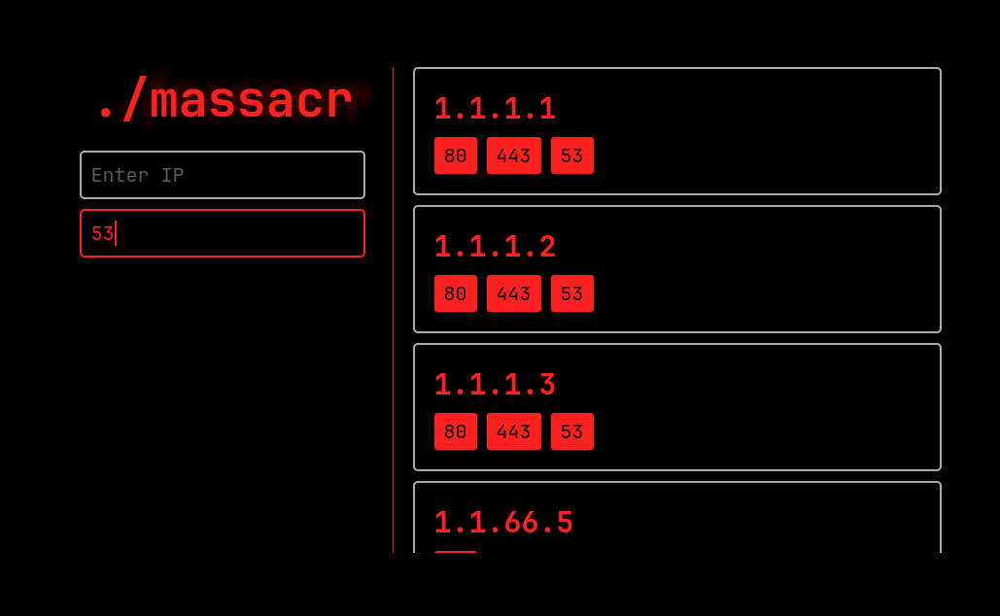

<h3 align="center">
  massacr 🩸 mass IP/port scanner
  </br>
  a tool for scanning the entire internet
  </br>
  </br>
  
</h3>

---

## Deploy
### Docker
The project contains a scanner and a simple database with a web interface. Easiest way to deploy these two is to use 
`docker-compose`. Here is an example configuration:
```yml
version: "3"
services:
  scanner:
    image: ghcr.io/ngn13/massacr/scanner
    command: --url=http://database:3231 --pwd=securepassword --limit=100
    depends_on:
      - database

  database:
    image: ghcr.io/ngn13/massacr/database
    restart: unless-stopped
    environment:
      - PASSWORD=securepassword
    ports:
      - "127.0.0.1:3231:3231"
    volumes:
      - ./data:/app/data
```
after deploying the containers, you can access the web interface at `http://localhost:3231`.

### From the source
Another way to deploy these two applications, is to build them from the source.
To build from source, first install all the dependencies and build tools: 
```bash
build-esssential libnet libnet-dev curl curl-dev go
```
Then clone the repository: 
```bash
git clone https://github.com/ngn13/massacr.git
```
Now change directory into the database and run the go build command:
```bash
cd massacr/database && go build .
```
Now change directory into the scanner and run the make command:
```bash 
cd ../scanner && make
```

## Configuration
### Database 
All the configuration options for the database are set using environment variables:
- `PASSWORD`: password, default is `default`
- `PORT`: port for the web server, default is `3231`

### Scanner 
You can list all the options with `--help`:
```
--no-color => Do not print colored output
--recvport => Source port for TCP packets
--timeout  => Timeout for receiver thread
--ports    => Ports to scan for
--limit    => Packets per second limit
--debug    => Enable debug output
--url      => Database HTTP(S) URL
--pwd      => Database password
```

- Options are set using the `--<option>=<value>` syntax
- For the `--ports` option, you can specify a single port, or you can specify ranges with `-` (`1-100`) and multiple ports with `,` (`80,443,1234`)
- Timeout is the time to wait after sending all the packets (in seconds), as the receiver thread may fell behind
- `--limit` is set to 20 by default, **which is pretty slow, so you should increase it**

> [!CAUTION]
> Do not go overkill on the `--limit` option, you will most likely end up using all the bandwidth and crash the entire network

Defaults for all the options are:
```
no-color => false
recvport => 13421
timeout  => 10
ports    => common
limit    => 20
debug    => false
url      => http://localhost:3231
pwd      => default
```

---

## Resources 
- [SYN scanning](https://nmap.org/book/synscan.html) (massacr does not exactly use SYN scan, it does not send RST packets)
- [libnet](https://github.com/libnet/libnet) (provides an easy way to build and send raw network packets)
