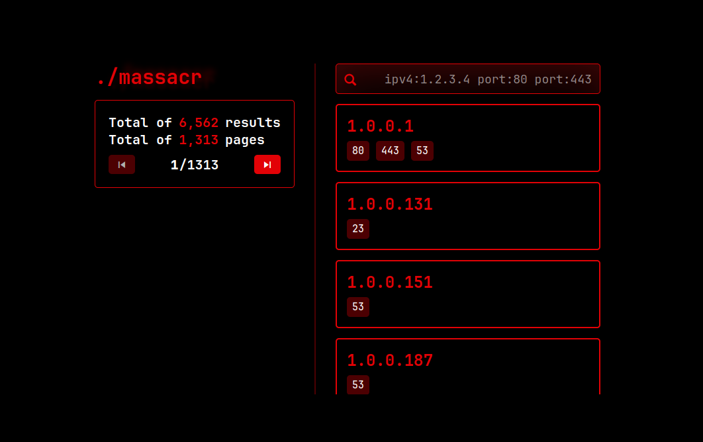

# massacr 🩸 mass IPv4/port scanner toolkit



---

An extensible toolkit for scanning the internet for TCP ports using SYN packets.

## How it works?
The core feature of massacr is the [scanner](scanner/), a program that sends massive
amounts of TCP SYN packets to different hosts on the internet.

When a host receives a TCP SYN packet on an open port, it sends back a TCP SYN+ACK
packet. The scanner has a seperate thread, listening for these SYN+ACKs. When a SYN+ACK
is received, the scanner adds the IPv4 and the port to a MongoDB database. You can then
process this information to discover different services and hosts on the internet.

massacr also includes a [simple web app](/app) that you can use to easily query the MongoDB
database for different hosts and ports.

## Deploy
To deploy the massacr toolkit with the scanner, web UI and mongo DB, you can use docker-compose:
```yaml
version: "3"
services:
  scanner:
    image: ghcr.io/ngn13/massacr/scanner
    command: --mongo=mongodb://db:27017 --limit=100
    depends_on:
      - db

  app:
    image: ghcr.io/ngn13/massacr/app
    restart: unless-stopped
    ports:
      - 127.0.0.1:8081:3000
    environment:
      - MONGO=mongodb://db:27017
    depends_on:
      - db

  db:
    image: mongo
    volumes:
      - ./data:/data/db:rw
```
after deploying the containers, you can access the web interface at `http://localhost:8081`.
You can also add your own tools and scripts to the compose file.

## Configuration
### Scanner
You can list all the options with `--help`:
```
--no-color   => Do not print colored output
--recvport   => Source port for TCP packets
--timeout    => Timeout for receiver thread
--ports      => Ports to scan for
--limit      => Packets per second limit
--startpoint => Address scanning startpoint
--mongo      => MongoDB URL
--threads    => Database thread count
--debug      => Enable debug output
```

- Use the `--<option>=<value>` syntax to set options.
- For the `--ports` option, you can specify a single port, or you can specify ranges with `-` (`1-100`) and multiple ports with `,` (`80,443,1234`), the default option
is `common`, this contains a list of common ports, which you can check out in the [util.c file](scanner/util/util.c).
- Timeout is the time to wait after sending all the packets (in seconds), as the receiver thread may fell behind
- `--limit` is set to 20 by default, **which is pretty slow, so you should increase it.** However do not go overkill! Your router or your bandwidth may not be able handle
all the active TCP connections, and you may end up crashing the entire network.

Defaults for all the options are:
```
no-color   => false
recvport   => 1337
timeout    => 600
ports      => common
limit      => 20
startpoint => 0.0.0.0
mongo      => mongodb://localhost:27017
threads    => 10
debug      => false
```

### App
Web app has just a single option:
- `MONGO`: MongoDB URL

## Resources
Here are some different resources that I used during the development:
- [SYN scanning](https://nmap.org/book/synscan.html) (massacr does not exactly use SYN scan, it does not send RST packets)
- [libnet](https://github.com/libnet/libnet) (provides an easy way to build and send raw network packets)
- [mongo-c-driver](https://www.mongodb.com/docs/languages/c/c-driver/current/libmongoc/tutorial/)
